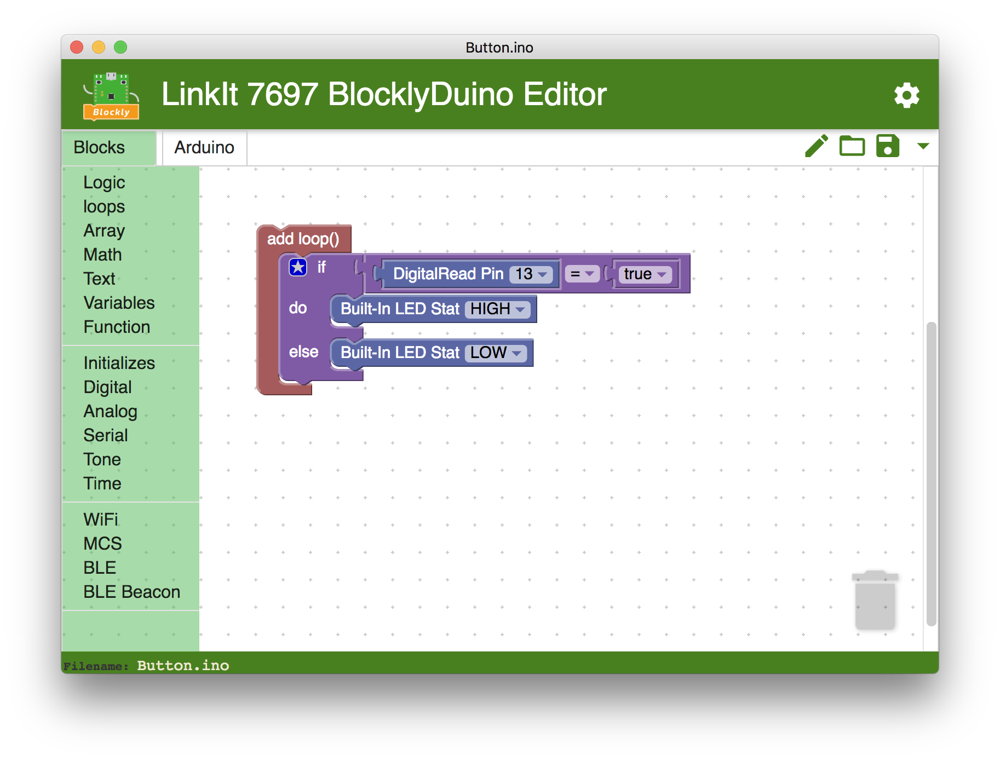

# Welcome to BlocklyDuino Editor



**BlocklyDuino** is a web-based visual programming editor for [Arduino](http://www.arduino.cc/) based on [Blockly](https://developers.google.com/blockly/), the web-based, graphical programming editor developed by *[Google](https://github.com/google)*, provide static type language blocks and code generators for Arduino programming.

**BlocklyDuino Editor** is based on the original work of *[Fred Lin](https://github.com/gasolin)* and others, adding supports for MediaTek's LinkIt boards.

## Features

- Programming Arduino with visually drag and drop code blocks.
- Generate Arduino compatible source code for MediaTek's LinkIt boards.

## Usage

Please checkout the project [Wiki](https://github.com/MediaTek-Labs/BlockyDuino-for-LinkIt/wiki) for installation and usage.

## Credits

[Fred Lin](https://github.com/gasolin), [Neil Fraser](https://github.com/NeilFraser), Q.Neutron, [Dale Low](https://github.com/gumbypp), [Hiroyuki Okada](https://github.com/okhiroyuki), [Colin Sheaff](https://github.com/selfsimilar) and others.

### License

```
Copyright (C) 2017 MediaTek Inc.

Licensed under the Apache License, Version 2.0 (the "License");
you may not use this file except in compliance with the License.
You may obtain a copy of the License at

    http://www.apache.org/licenses/LICENSE-2.0

Unless required by applicable law or agreed to in writing, software
distributed under the License is distributed on an "AS IS" BASIS,
WITHOUT WARRANTIES OR CONDITIONS OF ANY KIND, either express or implied.
See the License for the specific language governing permissions and
limitations under the License.
```
