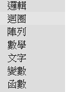
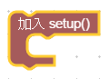
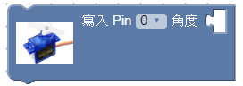
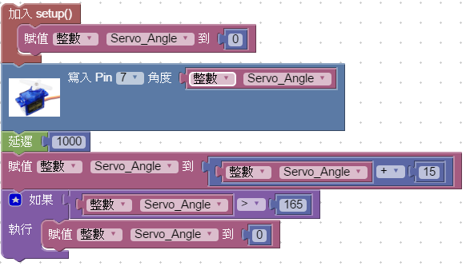
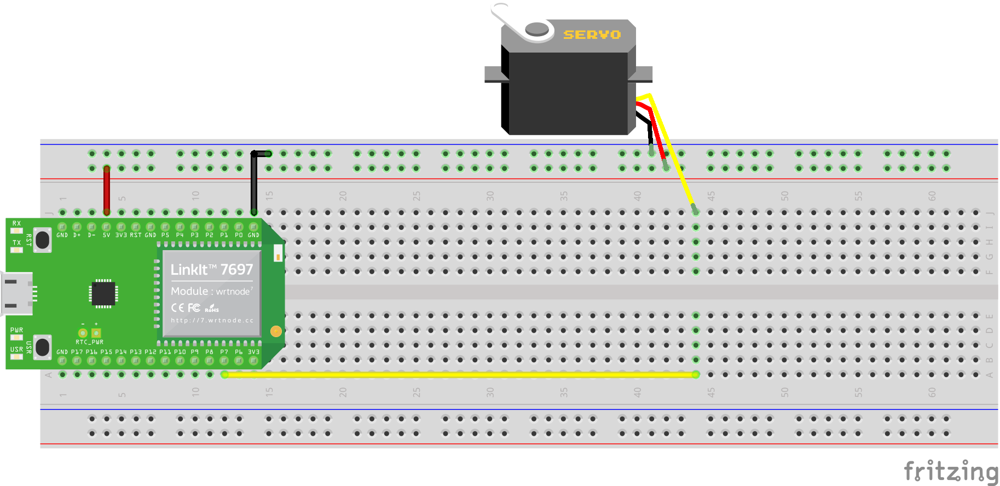

# EXAMPLE : Servo Sweep
**註：本文中所使用的 Block ，其功能將以正體中文為示例主語言**

## 給使用者/開發者的注意事項
1. 在BloclyDuino，若您想要取用一個新的自定義變數，**您只需要將 "Item" 變數項重新命名**即可。
- 而下一次您需要其他的新變數時，系統將會自動建立一個新的 "Item" 供使用者自定義。
2. 對於曾使用 Arduino IDE 開發過的您，您可能需要知道：
- Void loop 的部分不需要另作宣告。
- 除 **加入Setup** 下的子 Block 外的 Block ，將會自動併入 Void loop 當中。

3. 如果您找不到您需要的分類項，請點右上角的齒輪按鈕，並在 "選擇性積木" 中點擊您需要的分類。
- 當您點擊成功，您應該會看到：


## 閱讀下文示例的您應該注意的幾件事：
- <> 代表著您可能需要在此括號中填入指定的資料。
- 例如：
- 假如本文章在某個環節需要您運用上圖的 Block ，將會用「 延遲 **< 資料 >** 」來告知您，意味著您需要在 **< 資料 >** 項填入您需要的數據，或**任何可供該 Block 運用的資訊**。
- 關於 BlockyDuino 的**分類項** ：
- 

- 本文在 Block 示例時，將會告知您需要在哪個分類項找到您可能會使用到的 Block.
- 如果您有需要自定義接腳，請參照下圖的pinout(接腳圖)：
- 
- 高解析度檔案： https://labs.mediatek.com/en/download/1ega2lbl

# EXAMPLE: Servo Sweep

## 您將在本例子使用的分類項 & Block：
### 邏輯
- 如果 < 事件 > 執行 < 事件 >
    - 
- < 資料 > 大於 < 資料 >
    - 

### 數學
- < 數字 >
    - 
### 變數
- 賦值 < 資料型態 > < 變數 > 到 < 資料 >
    - 
### 初始化
- 加入 Setup()
    - 
### 時間
- 延遲 < 資料 >
    - 
### Servo
- 寫入 Pin < 腳位 > 角度 < 資料 >
    - 

## Demo (實際示例)

燒入上圖的 Block 所生成的程式，您將可以看到 Servo 會在一開機轉回原點，之後在每秒都會多轉 15 度直至轉滿 180 度，轉滿後再次回到原點，循環上述流程。
### 測試用線路：


#### 測試元件：
1. Linkit 7697
2. Servo Motor (Ex:SG90)

## Workflow (工作流程)
1. 一開始，「加入 Setup()」將會對 「Servo_Angle」 做初始化的動作
- Servo_Angle 是一個**變數**，此變數能夠儲存當下的 Servo 角度。
2. 在 Block 「寫入 Pin < 腳位 > 角度 < 資料 >」，將資料傳送給 Servo 現在的角度值，使 Servo 轉至該角度
3. 延遲一秒鐘
- 「延遲 < 資料 >」的 < 資料 > 單位為ms = micro second
4. 將角度變數 (Servo_Angle) 存入新的值
- 本示例以 15 度為取樣角度
5. 在循環的最後，使用「如果 < 事件 > 執行 < 事件 >」做簡單的邏輯判斷
- 如果 < 角度大於165度 > 執行 < 將角度歸零 > 的動作。
- 在本示例中，角度大於165度，則意同於角度到達180度。
- 也可以將判斷條件改為角度等於180度，但本示例為嚴防角度值的偏差，特將判斷條件的範圍拉廣。
6. 回到 2.，進行循環 (loop)。
## Additional (額外補充)
下例是 Arduino IDE 的版本：

```arduino=
#include <Servo.h>

int Servo_Angle;

Servo myservo7;
void setup()
{
    Servo_Angle = 0;
    myservo7.attach(7);
}


void loop()
{
    myservo7.write(Servo_Angle);
    delay(1000);
    Servo_Angle = Servo_Angle - 15;
    if (Servo_Angle > 165) {
    Servo_Angle = 0;
    }
}
```

